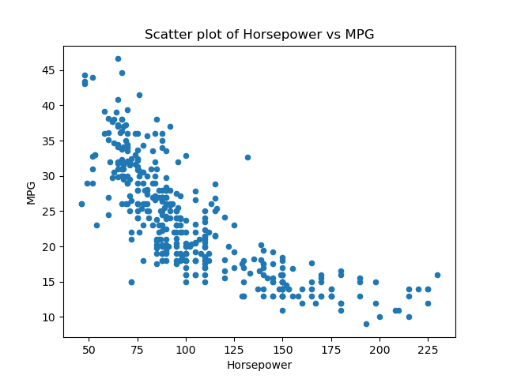
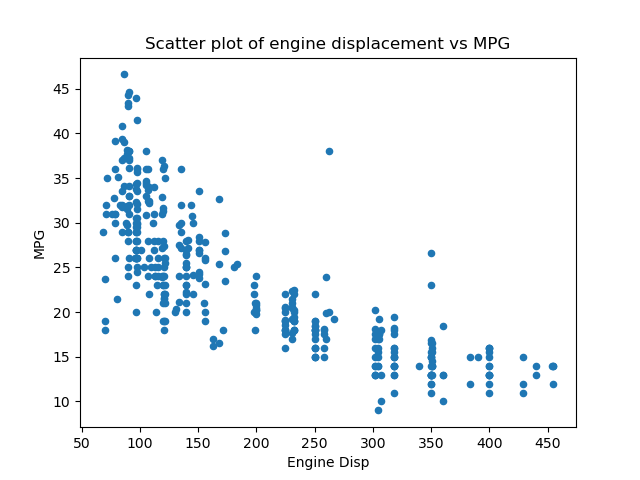
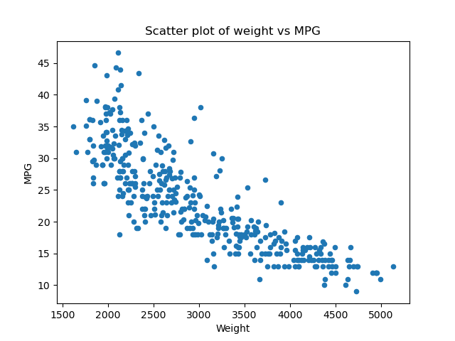
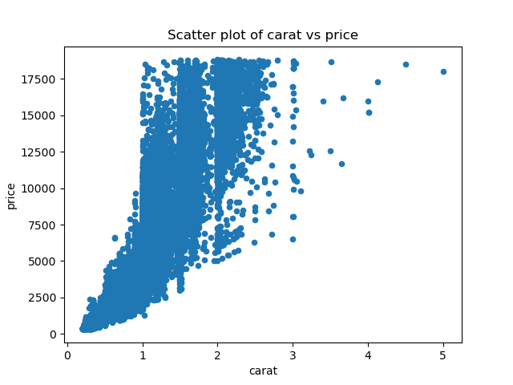
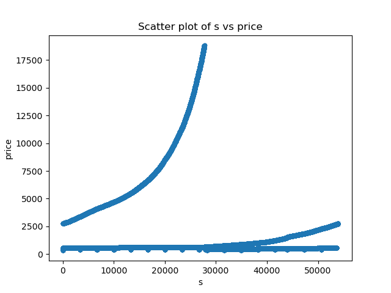
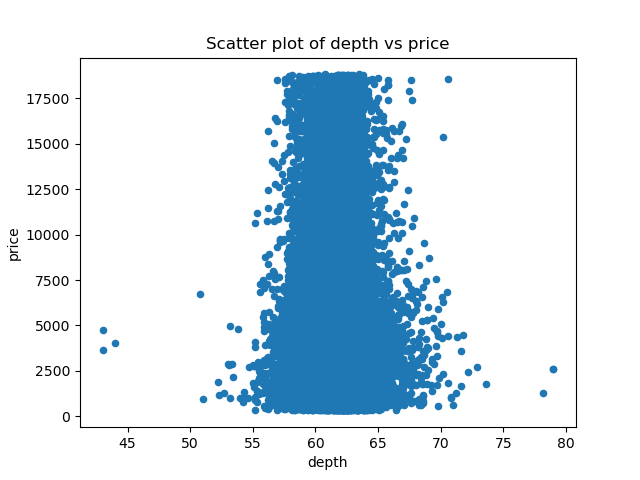
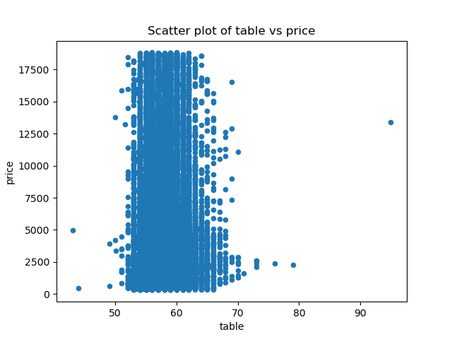

<div align="center">
  <h1> 📈 Linear Regression Project — Car MPG & Diamond Price</h1>
  </div>

This repository demonstrates an end-to-end, beginner-friendly but thorough workflow for **linear regression** using two classic datasets:

- **Auto MPG** — predict **miles-per-gallon (MPG)** from vehicle attributes  
- **Diamonds** — predict **price** from diamond characteristics

The notebook walks through **data loading → exploratory plots → feature selection → model training → evaluation → prediction**.  
All exploratory scatter plots are pre-exported and stored in the **`assets/`** folder for use in reports or slides.

<div align="center">
  
</div>

---

## 🎯 Objectives

- Build **simple linear regression models** for tabular prediction tasks  
- Practice **feature selection** and interpret exploratory plots  
- Evaluate models with **R² score** and make point **predictions**  
- Reuse plots (already exported to `assets/`)

---

## 🗂 Datasets

Loaded directly from IBM Skills Network public buckets (as used in the notebook):

- **Auto MPG**  
  `https://cf-courses-data.s3.us.cloud-object-storage.appdomain.cloud/IBM-BD0231EN-SkillsNetwork/datasets/mpg.csv`

- **Diamonds**  
  `https://cf-courses-data.s3.us.cloud-object-storage.appdomain.cloud/IBM-BD0231EN-SkillsNetwork/datasets/diamonds.csv`

---

## 🔍 Exploratory Data Analysis (EDA)

### A) Auto MPG — Relationships to MPG

The notebook visualizes how **engine/vehicle attributes** relate to **MPG**:

- Horsepower vs MPG  
  

- Cylinders vs MPG  
  

- Engine Displacement vs MPG  
  

- Weight vs MPG  
  

**Intuition from plots (typical patterns):**
- Higher **horsepower**, **cylinders**, **displacement**, and **weight** generally correlate with **lower MPG**.

---

### B) Diamonds — Relationships to Price

The notebook explores how physical characteristics relate to **price**:

- Carat vs Price  
  

- “s” vs Price *(as used in the notebook’s column selection)*  
  

- Depth vs Price  
  

- Table vs Price  
  

**Intuition from plots (typical patterns):**
- **Carat** vs **price** - strong positive correlation but also high variance (heteroscedasticity)
- **Depth** and **table** often show weaker or more nuanced relationships.

---

## 🧠 Feature Sets & Targets

### Auto MPG
- **Target:** `MPG`  
- **Features:** `Horsepower`, `Weight`

### Diamonds
- **Target:** `price`  
- **Features:** `carat`, `depth`  *(as per the model in the notebook)*

---

## 🧪 Modeling & Evaluation

Both tasks use **`sklearn.linear_model.LinearRegression`** trained on the full dataset (no split in the lab).  
Evaluation uses the **R² score** (`model.score(X, y)`), where **higher is better**.

### Results

#### 1) Auto MPG — Linear Regression
- **Model:** `MPG ~ Horsepower + Weight`  
- **R² (on full data):** **0.7063752737298348**  
- **Example prediction:**  
  Input **Horsepower = 100**, **Weight = 2000** ⇒ **MPG ≈ 29.3216**

**Interpretation:**  
A simple two-feature linear model captures a substantial share of variance in MPG (≈70%). Plots indicate the expected negative relationships between power/weight and fuel economy.

---

#### 2) Diamonds — Linear Regression
- **Model:** `price ~ carat + depth`  
- **R² (on full data):** **0.8506754571636563**  
- **Example prediction:**  
  Input **carat = 0.3**, **depth = 60** ⇒ **price ≈ 244.956**

**Interpretation:**  
With just **carat** and **depth**, the model explains ~85% of price variance—**carat** is highly predictive; **depth** adds a smaller adjustment.

---

## 🧭 Step-by-Step (Notebook Flow)

1. **Load data** via `pandas.read_csv` from the given URLs  
2. **Visual EDA** with `DataFrame.plot.scatter` to inspect relationships  
3. **Select features/target** per task  
4. **Instantiate & fit** `LinearRegression()`  
5. **Evaluate** with `model.score(X, y)` (R²)  
6. **Predict** sample values to sanity-check the model

---

## 🛠️ Tech Stack

- **Python 3.10+**, **Jupyter Notebook/Lab**  
- **Libraries:** `pandas`, `numpy`, `matplotlib`, `scikit-learn`

### Quick install
```bash
pip install pandas numpy matplotlib scikit-learn jupyterlab

▶️ How to Run

# 1) Clone
git clone https://github.com/ShyamSundarVijayakumar/linear_regression_project.git
cd linear_regression_project

# 2) (Optional) Create & activate a venv
python -m venv venv
# Windows: .\venv\Scripts\activate
# macOS/Linux:
source venv/bin/activate

# 3) Install deps
pip install -r requirements.txt

# 4) Launch
jupyter lab
# Open "Building_and_training_a_model_using_Linear_Regression.ipynb" and run cells
```

---

## ✅ Key Takeaways

- **Simple linear models can be strong baselines**:
   - Auto MPG with only Horsepower and Weight already achieves R² ≈ 0.71.
   - Diamonds with just carat and depth achieves R² ≈ 0.85.
- EDA guides feature choices: Visual trends in scatter plots help prioritize variables.
- Predictions are interpretable: The model outputs make intuitive sense when cross-checked with domain intuition.

---

## 💡 Suggestions / Next Steps

- **Train/Test Split or Cross-Validation**:
   - Evaluate generalization (e.g., train_test_split or KFold) and report test R².

- **Residual Diagnostics**
  - Plot residuals vs fitted, check normality of residuals, and look for heteroscedasticity.

- **Add/Compare Models**
 - Try Ridge/Lasso/ElasticNet (regularization), PolynomialFeatures, and tree-based models; compare metrics.

- **Scaling**
  - Standardize features if you expand to models sensitive to scale.

---

## 👨‍💻 Author
<div style="display: flex; align-items: center; gap: 20px">  <div> <strong>Shyam Sundar Vijayakumar</strong><br> Data Scientist | Optimization Specialist </div> </div>

---

## 📜 License
This project is licensed under the MIT License.
Shared for educational and portfolio purposes. Attribution is appreciated.
